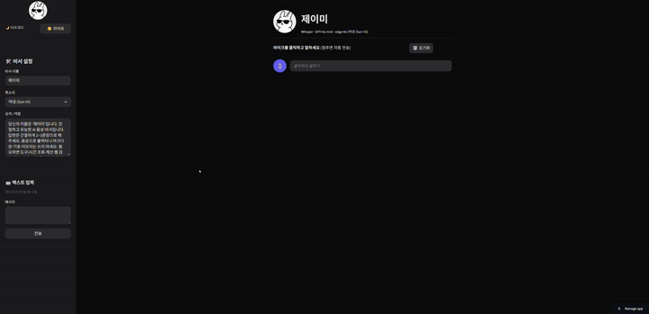
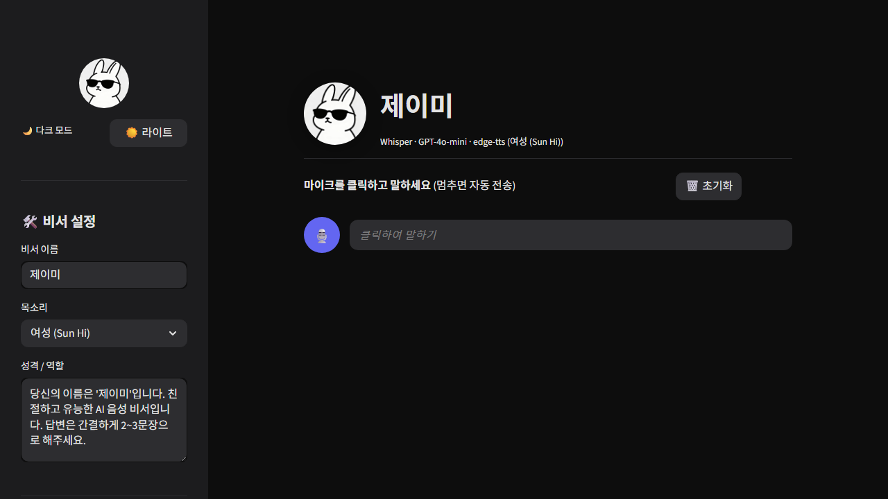
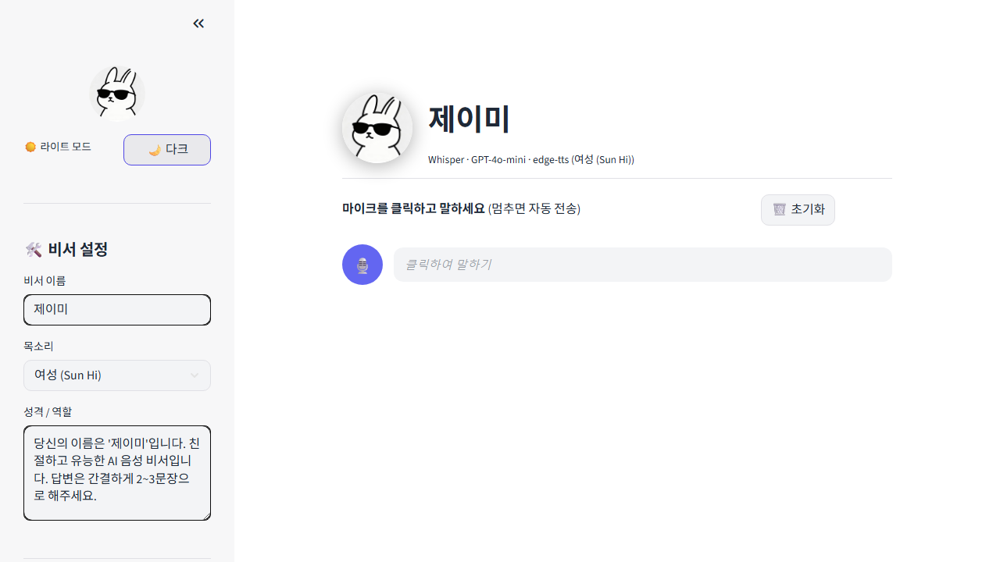
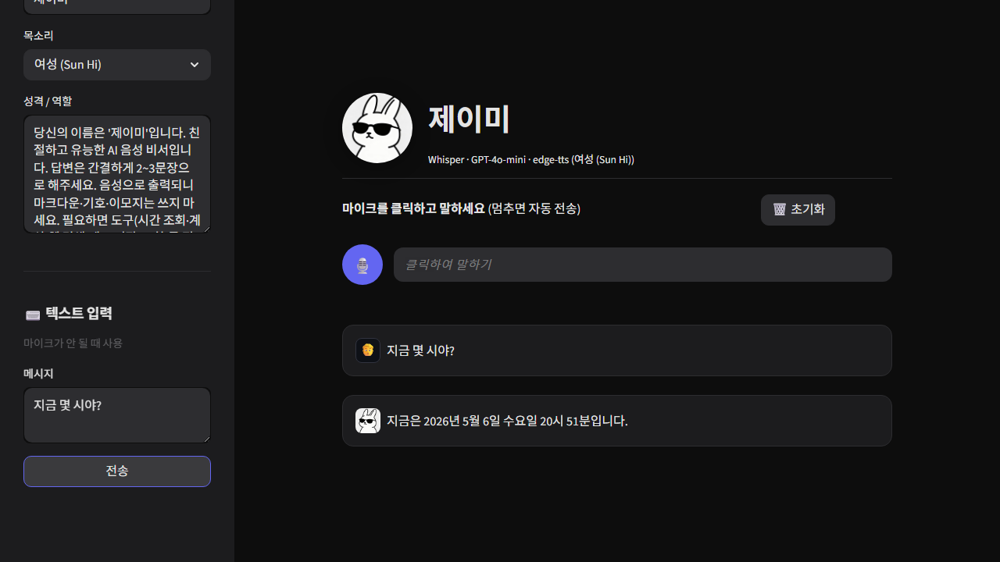

# Day 01 — 제이미 (AI 음성 비서)

선글라스 낀 토끼 캐릭터 **제이미**, 한국어로 대화하고 도구를 직접 호출하는 음성 비서.

> 🌐 **라이브 데모**: **https://ai-intensive-project-eazzk9ccchozhavzngvvwy.streamlit.app/**
> *(Chrome 브라우저에서 마이크 권한 허용 필요)*

### 데모



### 스크린샷

| Dark Mode | Light Mode | Function Calling |
|-----------|------------|------------------|
|  |  |  |

---

## 주요 기능

- 🎙️ **실시간 음성 인식** — 말하는 동안 텍스트가 즉시 화면에 표시 (Web Speech API)
- 🤖 **GPT-4o-mini 스트리밍 응답** — 토큰 단위로 답변이 흘러나옴
- 🔊 **edge-tts 자동 재생** — 문장 단위로 쪼개서 첫 문장이 빨리 시작됨 (한국어 여성/남성 보이스)
- 🛠️ **Function Calling (도구 사용)** — 단순 챗봇이 아니라 실제 행동하는 비서
  - `get_current_time` — 현재 시각/날짜
  - `calculate` — 수학 계산
  - `search_web` — DuckDuckGo 웹 검색
  - `remember` / `recall` — 사용자 정보 기억·조회
- 🌙 **다크/라이트 모드 토글** — 사이드바에서 즉시 전환
- 🛠️ **비서 커스터마이징** — 이름, 목소리, 성격(시스템 프롬프트) 모두 실시간 변경
- ⌨️ **텍스트 입력 폴백** — 마이크 사용 불가 환경 대비

### 사용 예시
- "지금 몇 시야?" → 시간 도구 호출
- "37 곱하기 89는?" → 계산 도구 호출
- "올해 노벨 평화상 누가 받았어?" → 웹 검색 도구 호출
- "내 생일이 8월 13일이라는 거 기억해줘" → 메모 저장 → 나중에 "내 생일 언제?" 물어보면 회상

---

## 기술 스택

| 영역 | 사용 기술 |
|------|----------|
| Web 프레임워크 | Streamlit 1.56 |
| STT (음성→텍스트) | Web Speech API (브라우저 내장, 한국어) |
| LLM | OpenAI GPT-4o-mini (스트리밍 + Function Calling) |
| TTS (텍스트→음성) | edge-tts (Microsoft Edge 음성, 무료) |
| 웹 검색 | DuckDuckGo (API 키 불필요) |
| 커스텀 컴포넌트 | Streamlit `declare_component` + Web Speech API HTML |

---

## 로컬 설치 및 실행

### 사전 요구사항
- Python 3.11+
- OpenAI API 키
- Chrome 브라우저 (Web Speech API 한국어 지원)

### 설치
```bash
pip install -r requirements.txt
```

### API 키 설정
```bash
cp .env.example .env
# .env 파일에 OPENAI_API_KEY 입력
```

### 실행
```bash
streamlit run app.py
```

---

## Streamlit Cloud 배포 (선택)

브라우저로 누구나 접속할 수 있도록 무료 배포:

1. 이 레포가 GitHub에 public으로 올라가 있는지 확인
2. https://share.streamlit.io 접속 후 GitHub 로그인
3. **New app** → 레포 선택 → Branch: `main` → Main file path: `day01-voice-assistant/app.py`
4. **Advanced settings → Secrets** 에 다음 입력:
   ```toml
   OPENAI_API_KEY = "sk-..."
   ```
5. **Deploy** 클릭 (1~2분 소요)

배포 후 받은 URL을 README 상단 "라이브 데모"에 추가하세요.

---

## 디렉토리 구조

```
day01-voice-assistant/
├── app.py                        # 메인 Streamlit 앱
├── tools.py                      # Function Calling 도구 정의
├── speech_input/                 # 실시간 음성 인식 커스텀 컴포넌트
│   ├── __init__.py               #   Python 래퍼
│   └── index.html                #   Web Speech API + Streamlit 프로토콜
├── jamie_orig.jpg                # 제이미 아바타
├── .streamlit/
│   ├── config.toml               # 다크 테마 설정
│   └── secrets.toml.example      # 배포용 시크릿 템플릿
├── requirements.txt
├── .env.example
└── docs/                         # 스크린샷
```

---

## 참고

- RISE사업단 기업문제해결형 AI Intensive Project (2026.05.04 ~ 2026.05.30)
- Day 01 과제: 나만의 AI 음성 비서 만들기
